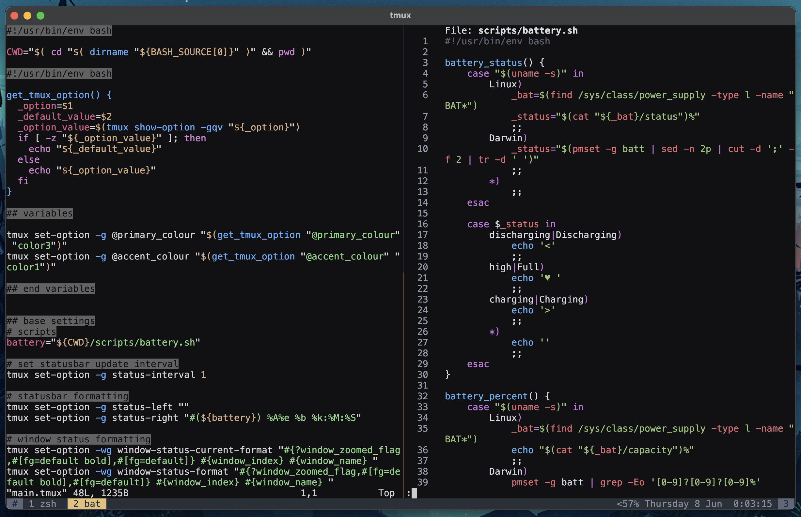

# emily-tmux `tpm` plugin theme

Screenshot with `vim` and `bat` with onehalf-dark from https://github.com/sonph/onehalf



## Options

Set colours:

```bash
# use any acceptable tmux colour format
set -g @primary_colour 'color3'
set -g @accent_colour '#e06c75'
```

## Installation

### Install through [Tmux Plugin Manager](https://github.com/tmux-plugins/tpm)

Add it to your list of `tpm` plugins in `.tmux.conf`

```bash
set -g @plugin 'ememilyly/emily-tmux'
```

Then use `prefix + I` to install.
